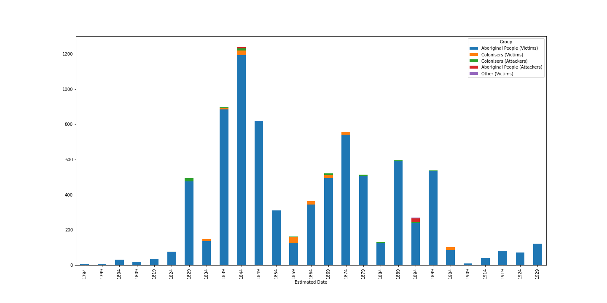
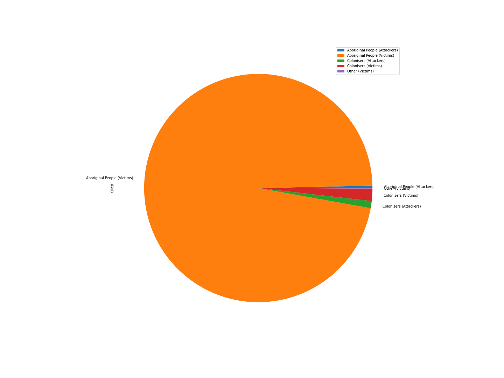

# aus-colonial-massacres

Machine readable version and basic reporting Colonial Australian Massacres 

This data was extracted from the timeline at [Colonial Frontier Massacres in Australia, 1788-1930](https://c21ch.newcastle.edu.au/colonialmassacres/)
in a project funded by [Australian Research Council](https://www.arc.gov.au/).

## Generation

All the code for generation can be found in [the jupyter notebook](analyses.ipynb).

## Usage

A machine-readable version of the data can be found in this repository at [aus-colonial-massacres.json](aus-colonial-massacres.json) this version preserves the original 
structure of the data as extracted from the page above. A second file [aus-colonial-massacres-cleaned.json](aus-colonial-massacres-cleaned.json) has taken liberties with the
structure and formatting of the data to provide a more machine readable version.

Below is a graph showing the frequency of massacres and the participants

## Citation

Ryan, Lyndall; Richards, Jonathan; Pascoe, William; Debenham, Jennifer; Stephanie Gilbert; Anders, Robert J; Brown, Mark; Smith, Robyn; Price, Daniel; Newley, Jack Colonial Frontier Massacres in Eastern Australia 1788 to 1930, v2.1 Newcastle: University of Newcastle, 2018, http://hdl.handle.net/1959.13/1340762 (accessed 30/10/2018). Funded by ARC: DP 140100399.

